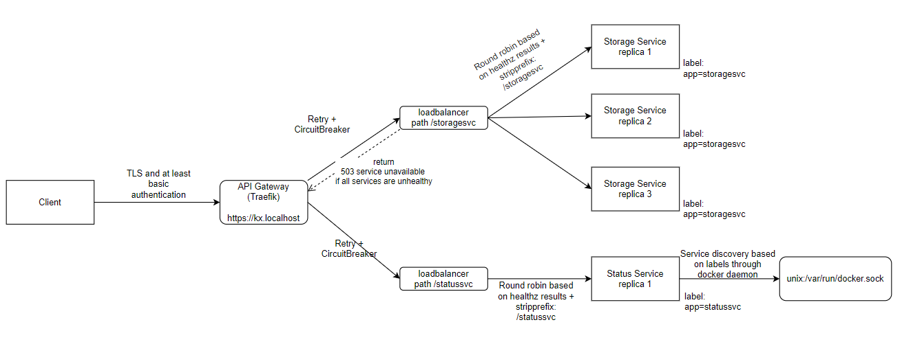

# KX Problem solving exercise

## Problem
We would like you to implement a distributed **Service Assembly** with a gateway component.

## Description
The service assembly will have the following components:
1) **Storage Service** - stores in-memory, dummy data that can be accessed through a REST GET call in JSON format
2) **Gateway Service** - main process that serves data to clients and tracks the availability of the Storage Services (there could be 0 to 3 available) and has the following REST endpoints
    * **/status** - returns the status of each Storage Service
    * **/data** - fetches the dummy data from a Storage Service (eg. with round robin) and returns the data in JSON format

We would like the services to be containerised and run with docker-compose.
The services can be implemented using any programming language.

## Architecture


## Acceptance criteria
* Please fork this git repository and work inside your own
* Provide a solution for the described problem and give us the instructions necessary to execute it
* We would like to have your solution in form of a Pull Request into the main repository
* _What should the Gateway do if no Storage Services are running?_


# Solution

# Usage 

Start the application with the following command:

```
docker-compose --env-file="./.env.dev" up
```

Note that there are two environments: .env and .env.dev. While using the development environment the user will be able to access swagger (OpenAPI documentation). Because of this I suggest to start the application in the development environment. (Since it is not a good practice to enable API documentation on production). 

# Endpoints

Each application has a swagger (only in development), where the user can try out the API's provided by a given service. Each application has a /healthz endpoint which can be used by docker daemon and traefik.

After starting the application the following endpoints should be available:

Status Service:
- http://kx.localhost:8081/statussvc/swagger
- http://kx.localhost:8081/statussvc/status?appName={appName}&id={id}
- http://kx.localhost:8081/statussvc/healthz

Applications inside the system are labelled. It is possible to query the status of an application type by it's app name (each replica has the same name). It is also possible to query the status of a replica by it's id.

Status endpoint returns the docker container state through the usage of docker daemon. It's current state is printed out.

---
Storage Service
- http://kx.localhost:8081/storagesvc/swagger
- http://kx.localhost:8081/storagesvc/data/{partitionkey}/{id}
- http://kx.localhost:8081/storagesvc/healthz

Routes:

- /data returns the keys of all partitions.
- /data/{partitionkey} returns all identifiers in the given partition
- /data/{partitionkey}/{id} returns the json object that is stored in memory
- returns http 404 in case the requested resource does not exists

---
API Gateway (Traefik)
- http://kx.localhost:8081/ 
  
Admins can see the services, middlewares, heaklthchecks, etc through the dashboard. This endpoint requires basic authentication. (User=user Password=password). Ensure that the browser does not block the pop ups. If it's hard to solve for some reason comment out the following labels in the docker-compose file:

```
      - "traefik.http.routers.traefik.middlewares=traefik-auth"
      - "traefik.http.middlewares.traefik-auth.basicauth.users=user:$$apr1$$l927e5dn$$7BzqJzd3vSl4ZJXIZsR0S0"
```
# Architecture

I used traefik (one of the most used reverse proxy/API gateway in kubernetes) as the API gateway. This would have make it tricky to implement a status endpoint on the API gateway itself (which wouldn't be a good idea either). Because of this I created a Status service that can return the statuses of the services behind the API gateway.

A not detailed sketch about the architecture:

 

Notable mentions:

- Both docker daemon and traefik are doing healthchecks. Docker daemon is doing it to update state (which is then reported by statusservice). Traefik determines load balancing by health responses. It does not forward traffic to a service which is unresponsive to healthchecks.
- StorageService docker is not running as root, however because of the docker socket usage I couldn't get StatusService to work without root access. I'm sure it is doable, but I didn't want to spend much time with it, since inside a production system I would host such a system inside a kubernetes cluster, where instead of the docker daemon I could use the API server for service discovery.
- I did not write test for StatusService, because of time pressure.
- I added basic authentication to the API Gateway only
- I added a retry middleware to services, but I did not add a CircuitBreaker.
- I did not configure TLS.
- Since Status service is discovering services through docker daemon, adding additional replicas to the system is easy. Just modify the replica count in the used .env file.
- Each request is logged through the request logging middleware in development mode.
- Code duplication in services are thought over. Microservices share nothing. Of course this does not mean that we can not develop shared libraries with shared functionality, but in a microservice architecture shared libraries can easily become a burden, especially through transitive dependencies - so developing shared libraries requires consideration. Up until a certain point code duplication is easier than package management.

A more complicated design decision: I used the pattern to route to services based on the path in the URL. There is another pattern: use subdomain for services. With the first approach if I want TLS, I don't need a wildcard certificate, however with subdomains I do. However, if the system gets to a multitenant/multi-region level, I would need wildcard certificates either way. I prefer to use routes behind the API gateway, and subdomains to distinguish between tenants/regions.

# _What should the Gateway do if no Storage Services are running?_

The easy answer to this is to return HTTP 503 not available. The problem with this is, what if it is a critical microservice? In that case HTTP 503 would make the system unusable, making the SLA lower.
To avoid this it is a good practice to make this service highly available in the first place. 

In K8s: 
- configure probes correctly to ensure self-healing
- make the container restart fast
- configure zones, anti affinities and pod distruption budgets to ensure that at least n replica is always available
- either the callers of the service or the load balancer should cache reponses. The system could still work for cached responses with eventual consistency in case all storage services are down.


